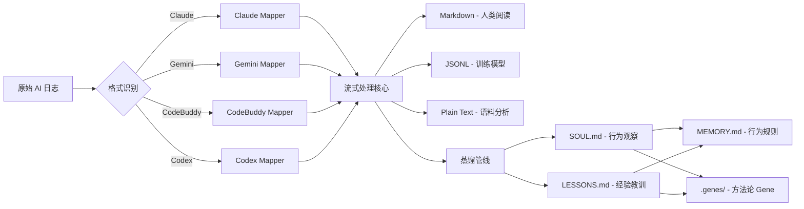

# ai-log-converter

> "别再让混乱的 AI 日志浪费你的生命。"

## 需求背景

当你使用 Claude Code, Gemini, CodeBuddy 或 Codex 时，它们产生的原始日志（JSON/JSONL）通常是一堆不可读的乱码。为了分析用户的提问习惯（心智模型），或者对比不同 AI 的回复质量，你需要一个高效、干净的手术刀，将这些数据切开并标准化。

**ai-log-converter** 就是这把手术刀。但它不止于此——它还能从日志中蒸馏出行为规则、经验教训、方法论 Gene，让每次 AI 对话都让下一次更聪明。

## 核心架构



## 支持的格式

- **Claude Code**: 深度支持子智能体（Subagent）识别及 XML 标签剥离。
- **Gemini**: 支持 `parts` 数组解析、工具调用及 `thoughts` 提取（自动计算 Slop 分数）。
- **CodeBuddy**: 清理内部输入/输出文本块及函数调用标记。
- **OpenAI Codex**: 针对 `response_item` 负载结构的精准提取。

## 核心特性

- **懂人心**：自动识别并跳过那些没用的元数据（Metadata），直奔对话主题。
- **Slop 指标**：内置"废话率"算法。通过 `Slop Score` (推理长度 / 整体长度)，帮你一眼识破那些在"胡思乱想"的 AI。
- **全量蒸馏**：200K 字符全量上下文提取行为观察，quality gate + grounding check 双重质量门控。
- **自我进化**：观察 → 规则 → 方法论 Gene，可衰减追踪，高频模式自动晋升建议。
- **无依赖**：纯 stdlib，无任何 `pip install` 负担。
- **超快**：JSONL 输入采用流式处理，即便处理 10GB 级别日志，内存占用也微乎其微。
- **零噪音**：默认成功时静默输出，仅在异常时写入 `stderr`。

## 快速开始

```bash
# 转换单个会话
python3 ai_log_converter.py input.jsonl output.md

# 全量采集 + 日报 + 推送 + 蒸馏（日常 cron 做的事）
make harvest && make report && make push && make soul && make lessons && make distill && make gene-health && make sync-memory

# 安装 cron（每天 08:47 自动执行上述全链路）
make install-cron
```

### 更多姿势

```bash
# 提取用户心智模型（纯文本分析）
python3 ai_log_converter.py -t txt --role user input.jsonl user_mind.txt

# 准备自动化训练集（标准化 JSONL）
python3 ai_log_converter.py -t jsonl --role assistant input.jsonl train_data.jsonl

# 创建一个方法论 Gene
scripts/extract-gene.sh plan-before-act
```

## 转换器参数

```
-f FORMAT          强制格式: claude | gemini | codebuddy | codex (默认: 自动检测)
-t TYPE            输出: md | txt | jsonl (默认: md)
--role ROLE        过滤: user | assistant | all (默认: all)
--no-thoughts      去除推理/思考块
--slop             显示 Slop Score（推理占比）
```

## 蒸馏管线

七个子命令，串联成完整的知识蒸馏链路：

| 子命令 | 做什么 |
|--------|--------|
| `report` | 日报：精确工具统计 + LLM 摘要 |
| `push` | 推送日报到企业微信群 |
| `soul` | 全量上下文行为观察提取（quality-gated + grounded） |
| `lessons` | 经验教训提取：坑/因/法（跨项目可迁移的错题本） |
| `distill` | 蒸馏 SOUL + LESSONS → MEMORY.md 行为规则 |
| `gene-health` | Gene 新鲜度衰减、registry 重建、健康报告 |
| `sync-memory` | 提交并推送到远端知识仓库 |

## 文件结构

```
ai_report.py          流水线：7 个子命令，数据流转逻辑
ai_engine.py          引擎：codex exec (128K) → call_llm fallback (auto-batch)
ai_prompts.py         数据：所有 prompt 常量，纯文本无逻辑
ai_log_converter.py   转换器：4 种格式 mapper，流式处理
```

三文件按变更轴分离：引擎（低频）/ 提示词（中频）/ 流水线（高频）。

## 配置

```bash
# .env (auto-loaded)
LLM_API_KEY=xxx
LLM_BASE_URL=http://...          # optional
LLM_MODEL_NAME=glm-5             # optional
WECOM_WEBHOOK_URL=https://...    # optional, for push
```

---
*Talk is cheap. Show me the code.*
