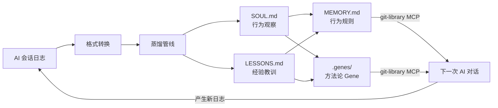

# ai-log-converter

> "每一次 AI 对话，都让下一次更聪明。"

## 做什么

把 AI 工具的原始日志变成**可自我迭代的知识系统**。

不只是格式转换——是一个闭环：日志 → 观察 → 规则 → 方法论 → 回流到下次 AI 对话。你用得越多，AI 就越懂你。



关键在最后那条回路。MEMORY.md 和 Gene 通过 git-library MCP 分发到所有项目的 AI Agent，Agent 在对话中读取并遵循你的规则，产生新的日志，再被蒸馏。**闭环自转。**

## 蒸馏管线

每天 cron 自动执行完整链路：

```
harvest → report → push → soul → lessons → distill → gene-health → sync-memory
   │         │       │      │        │         │          │            │
   │         │       │      │        │         │          │            └─ 推送到知识仓库
   │         │       │      │        │         │          └─ Gene 衰减追踪
   │         │       │      │        │         └─ 蒸馏规则 → MEMORY.md
   │         │       │      │        └─ 提取教训 → LESSONS.md
   │         │       │      └─ 提取观察 → SOUL.md
   │         │       └─ 推送到企微群
   │         └─ 生成日报
   └─ 采集日志
```

| 子命令 | 做什么 |
|--------|--------|
| `report` | 日报：精确工具统计 + LLM 摘要 |
| `push` | 推送日报到企业微信群 |
| `soul` | 全量上下文（200K）行为观察提取，quality gate + grounding check 双重门控 |
| `lessons` | 经验教训提取：坑/因/法，只留跨项目可迁移的错题本 |
| `distill` | 蒸馏 SOUL + LESSONS → MEMORY.md 行为规则（MUST/MUST_NOT/PREFER/CONTEXT） |
| `gene-health` | Gene 新鲜度衰减模型，registry 重建，晋升建议 |
| `sync-memory` | 提交并推送到远端知识仓库，供 git-library MCP 检索分发 |

## 自我迭代是怎么发生的

```
Day 1: soul 提取到 "用户坚持 plan-before-act"（观察）
Day 3: 同一 pattern-key 出现 3 天 → distill 生成 MUST 规则
Day 5: lessons 提取到 "不 plan 就动手导致返工"（教训）
Day 7: pattern-key ≥3 天 → distill 建议晋升为 Gene
       → 人工执行 extract-gene.sh → 方法论固化为可版本化的 Gene
Day 8: 新项目的 AI Agent 通过 git-library 读到这条 Gene → 主动遵循
       → 产生新日志 → 回到 Day 1
```

- **弱信号**（1 天出现）→ 观察记录，不生成规则
- **中等信号**（2 天）→ 加入 PREFER
- **强信号**（≥3 天）→ 晋升 MUST，建议提取 Gene
- **Gene 衰减**：90 天不使用 → freshness 归零，标记 degraded

规则不是只增不减。长期未被观察引证的规则会被 WEAKEN/REMOVE——进化，不是堆积。

## 转换器

同时也是一把高效的日志格式转换工具：

- **Claude Code**: 深度支持子智能体识别及 XML 标签剥离
- **Gemini**: `parts` 数组解析、工具调用、`thoughts` 提取
- **CodeBuddy**: 内部文本块清理及函数调用标记
- **OpenAI Codex**: `response_item` 负载结构精准提取

```bash
# 基础转换
python3 ai_log_converter.py input.jsonl output.md

# 提取用户心智模型
python3 ai_log_converter.py -t txt --role user input.jsonl user_mind.txt

# Slop Score — 一眼识破在"胡思乱想"的 AI
python3 ai_log_converter.py --slop input.jsonl output.md
```

```
-f FORMAT          强制格式: claude | gemini | codebuddy | codex (默认: 自动检测)
-t TYPE            输出: md | txt | jsonl (默认: md)
--role ROLE        过滤: user | assistant | all (默认: all)
--no-thoughts      去除推理/思考块
--slop             显示 Slop Score（推理占比）
```

## 快速开始

```bash
# 全量采集 + 蒸馏全链路（日常 cron 做的事）
make harvest && make report && make push && make soul && make lessons && make distill && make gene-health && make sync-memory

# 安装 cron（每天 08:47 自动执行）
make install-cron

# 创建一个方法论 Gene
scripts/extract-gene.sh plan-before-act
```

## 架构

```
ai_report.py          流水线：7 个子命令，数据流转逻辑
ai_engine.py          引擎：codex exec (128K) → call_llm fallback (auto-batch)
ai_prompts.py         数据：所有 prompt 常量，纯文本无逻辑
ai_log_converter.py   转换器：4 种格式 mapper，流式处理
```

三文件按变更轴分离：引擎（低频）/ 提示词（中频）/ 流水线（高频）。

## 配置

```bash
# .env (auto-loaded)
LLM_API_KEY=xxx
LLM_BASE_URL=http://...          # optional
LLM_MODEL_NAME=glm-5             # optional
WECOM_WEBHOOK_URL=https://...    # optional, for push
```

无依赖，纯 stdlib。流式处理，10GB 级别日志内存无压力。成功时零输出。

---
*Talk is cheap. Show me the code.*
